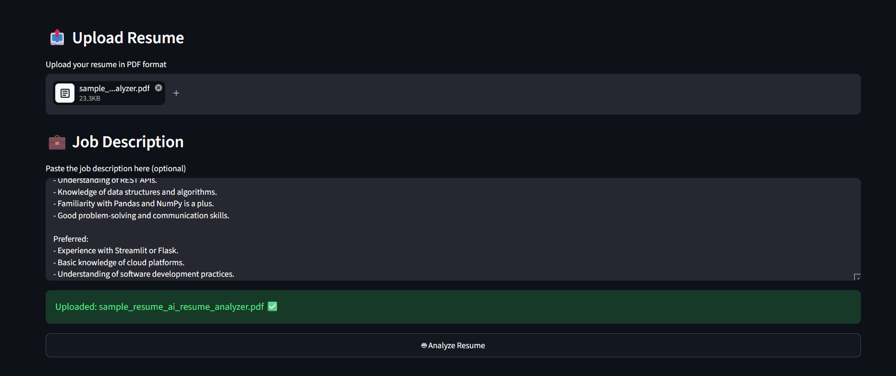
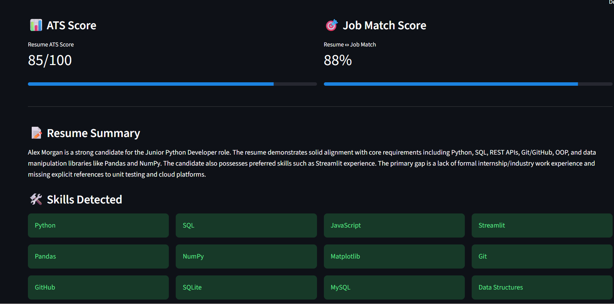

# 📄 AI Resume Analyzer

An AI-powered resume analysis and job matching application built with Python, Streamlit, and Google Gemini.

The application analyzes a candidate's resume, calculates an ATS score, compares the resume with a job description, identifies matching and missing skills, and provides actionable recommendations for improving the resume.

---

## 🚀 Features

- 📄 Upload resumes in PDF format
- 🤖 AI-powered resume analysis using Google Gemini
- 📊 ATS resume score
- 🎯 Job match score
- 🛠️ Automatic skill detection
- ✅ Matching skills identification
- ❌ Missing skills identification
- 🔑 Job-specific keyword extraction
- 💪 Resume strengths
- ⚠️ Resume weaknesses
- 🎯 Recommended skills
- 💼 Suitable job roles
- 💡 Resume improvement suggestions
- 📥 Downloadable resume analysis report
- 🎨 Clean and interactive Streamlit interface

---

## 🖥️ Application Preview

### Dashboard



### Resume Analysis



### Recommendations


### Download Analysis


---

## 🛠️ Technologies Used

- **Python**
- **Streamlit**
- **Google Gemini API**
- **PyPDF**
- **python-dotenv**

---

## 📂 Project Structure

```text
AI Resume Analyzer/
│
├── screenshots/
│   ├── dashboard.png
│   ├── analysis.png
│   ├── recommendations.png
│   └── download-analysis.png
│
├── src/
│   ├── app.py
│   ├── analyzer.py
│   ├── resume_parser.py
│   └── utils.py
│
├── .gitignore
├── requirements.txt
└── README.md